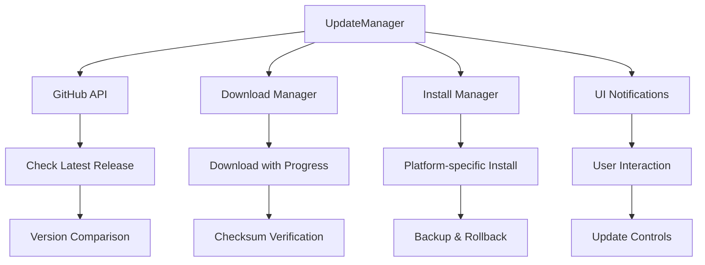

# Auto-Update System - Hướng dẫn triển khai

## Tổng quan

TTL TikTok Live đã được tích hợp hệ thống auto-update với GitHub Releases, cho phép ứng dụng tự động kiểm tra và cập nhật phiên bản mới.

## Kiến trúc



## Components

### 1. UpdateManager (`lib/update-manager.js`)
- **Chức năng**: Core update logic, GitHub API integration
- **Features**:
  - Auto-check theo interval (30 phút - 24 giờ)
  - Download với progress tracking
  - Platform-specific installation (Windows/macOS/Linux)
  - Backup và rollback capability
  - Checksum verification

### 2. UpdateHandlers (`main/handlers/updateHandlers.js`)
- **Chức năng**: IPC handlers cho update operations
- **APIs**:
  - `update-check`: Manual update check
  - `update-get-status`: Get current status
  - `update-download-install`: Download và install
  - `update-settings`: Update preferences

### 3. UpdateNotification (`renderer/components/UpdateNotification.js`)
- **Chức năng**: UI notification component
- **Features**:
  - Update available notification
  - Download progress indicator
  - Release notes display
  - User action buttons (Download/Skip/Dismiss)

### 4. UpdateManager Settings (`renderer/components/UpdateManager.js`)
- **Chức năng**: Settings panel trong Settings page
- **Features**:
  - Auto-check toggle
  - Check interval selection
  - Current version display
  - Advanced options

## Deployment Workflow

### 1. GitHub Actions Setup (`.github/workflows/release.yml`)

**Triggers:**
- Git tags matching `v*.*.*` pattern
- Manual workflow dispatch

**Build Matrix:**
- Windows (latest)
- macOS (latest) 
- Linux (latest)

**Outputs:**
- `.exe` file cho Windows
- `.dmg` file cho macOS
- `.AppImage` file cho Linux
- SHA256 checksums cho tất cả files

### 2. Release Process

```bash
# Option 1: Automatic via npm scripts
npm run release:patch    # 1.0.0 -> 1.0.1
npm run release:minor    # 1.0.0 -> 1.1.0  
npm run release:major    # 1.0.0 -> 2.0.0

# Option 2: Manual tag creation
git tag v1.0.1
git push origin v1.0.1

# Option 3: GitHub Actions manual dispatch
# Go to Actions tab -> Release Build -> Run workflow
```

### 3. Repository Configuration

**Required GitHub Secrets:**
```
GITHUB_TOKEN              # Auto-generated
MACOS_CERTIFICATE         # Base64 encoded .p12 file
MACOS_CERTIFICATE_PASSWORD # Certificate password
APPLE_ID                  # Apple Developer ID
APPLE_ID_PASSWORD         # App-specific password
APPLE_TEAM_ID            # Apple Team ID
WINDOWS_CERTIFICATE      # Code signing certificate
WINDOWS_CERTIFICATE_PASSWORD # Certificate password
```

## User Experience

### 1. Auto-Check Flow
```
App Start -> Wait 30s -> Check GitHub API -> Compare Versions
    |
    ├─ No Update -> Schedule Next Check (1 hour default)
    |
    └─ Update Available -> Show Notification -> User Choice
                              |
                              ├─ Download -> Progress -> Install -> Restart
                              ├─ Skip Version -> Hide permanently
                              └─ Dismiss -> Hide until next check
```

### 2. Manual Check Flow
```
Settings Page -> Update Section -> Check Now Button
    |
    └─ Same as Auto-Check but shows immediate feedback
```

### 3. Update Settings
- **Auto-check**: Enable/disable automatic checking
- **Interval**: 30 minutes, 1 hour, 4 hours, daily
- **Channel**: Stable (future: Beta, Alpha)

## Platform-Specific Implementation

### Windows
- **Installer**: NSIS-based silent installer
- **Installation**: Run with `/S` flag for silent install
- **Backup**: Copy current executable
- **Code Signing**: Authenticode với certificate

### macOS
- **Package**: DMG với signed app bundle
- **Installation**: Mount DMG, copy to Applications
- **Backup**: Time Machine compatible
- **Code Signing**: Apple Developer certificate + Notarization

### Linux
- **Package**: AppImage (portable executable)
- **Installation**: Replace current binary
- **Backup**: Copy current executable
- **Permissions**: Auto-set executable flag

## Security Considerations

### 1. Download Verification
- SHA256 checksum verification
- HTTPS-only downloads
- Signature verification (when available)

### 2. Installation Safety
- Automatic backup before installation
- Rollback capability
- Permission validation

### 3. GitHub API Security
- Rate limiting handling
- Error recovery
- Timeout protection

## Monitoring & Analytics

### 1. Update Events
```javascript
// Events tracked
- update-checking
- update-available  
- update-not-available
- download-started
- download-progress
- download-completed
- install-started
- install-completed
- update-error
```

### 2. Error Handling
- Network timeout errors
- Download corruption
- Installation failures
- Permission errors
- Disk space issues

### 3. User Analytics (Future)
- Update adoption rates
- Error frequency
- Platform distribution
- Update delay patterns

## Testing Strategy

### 1. Development Testing
```bash
# Test update check
npm run dev
# In app: Settings -> Update -> Check Now

# Test with mock releases
# Modify updateCheckUrl in UpdateManager
```

### 2. Staging Testing
- Test với pre-release tags
- Verify all platforms
- Test rollback scenarios

### 3. Production Testing
- Monitor first release carefully
- A/B test update frequency
- Track error rates

## Troubleshooting

### Common Issues

1. **Update Check Fails**
   - Check internet connection
   - Verify GitHub API rate limits
   - Check repository access

2. **Download Fails**
   - Check disk space
   - Verify download permissions
   - Check firewall/antivirus

3. **Installation Fails**
   - Check admin permissions
   - Verify app is not running multiple instances
   - Check backup space

### Debug Commands
```bash
# Check update status
updateManager.getStatus()

# Force update check
updateManager.checkForUpdates(true)

# View update logs
# Check console output in DevTools
```

## Future Enhancements

### Short-term
- [ ] Delta updates (smaller downloads)
- [ ] Update rollback UI
- [ ] Beta/Alpha channel support
- [ ] Progress persistence across restarts

### Long-term
- [ ] P2P update distribution
- [ ] Custom update server support
- [ ] A/B testing framework
- [ ] Update analytics dashboard

## API Documentation

### UpdateManager Methods

```javascript
// Public API
updateManager.checkForUpdates(manual: boolean)
updateManager.downloadAndInstall(updateInfo: Object)
updateManager.updateSettings(settings: Object)
updateManager.getStatus()
updateManager.restartApplication()

// Events
updateManager.on('update-available', handler)
updateManager.on('download-progress', handler)
updateManager.on('install-completed', handler)
```

### IPC Channels

```javascript
// Renderer -> Main
'update-check'
'update-get-status' 
'update-download-install'
'update-settings'
'update-restart-app'

// Main -> Renderer
'update-available'
'download-progress'
'install-completed'
```

---

## Quick Start

1. **Setup GitHub Secrets** (if using code signing)
2. **Test local build**: `npm run electron:build:all`
3. **Create release**: `npm run release:patch`
4. **Verify GitHub Actions** workflow completes
5. **Test update** in development app

Hệ thống auto-update đã sẵn sàng hoạt động! 🚀 