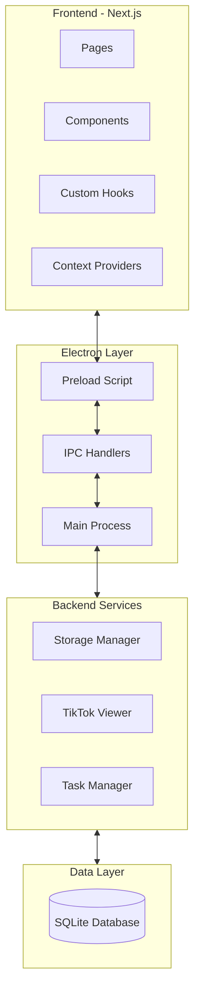

# Kiến trúc hệ thống & Mô hình thiết kế - TTL TikTok Live

## Tổng quan kiến trúc

TTL TikTok Live được xây dựng theo kiến trúc Electron kết hợp với Next.js, tạo ra một ứng dụng desktop đa nền tảng với giao diện người dùng hiện đại và khả năng mở rộng.



### Thành phần chính

1. **Frontend (Renderer Process)**
   - Next.js framework
   - React components và hooks
   - Context API cho state management
   - Tailwind CSS cho UI/UX

2. **Electron Layer**
   - Main process: Quản lý vòng đời ứng dụng
   - Preload script: Cầu nối an toàn giữa renderer và main
   - IPC Handlers: Xử lý giao tiếp giữa các process

3. **Backend Services**
   - Storage Manager: Quản lý lưu trữ dữ liệu
   - TikTok Viewer: Kết nối với TikTok Live
   - Task Manager: Quản lý tác vụ tự động

4. **Data Layer**
   - SQLite Database: Lưu trữ tất cả dữ liệu ứng dụng

## Mô hình dữ liệu

### Cấu trúc cơ sở dữ liệu

```mermaid
erDiagram
    folders ||--o{ accounts : contains
    folders ||--o{ proxies : contains
    accounts }o--o{ rooms : watches
    proxies ||--o{ accounts : used_by
    rooms ||--o{ viewer_history : has

    folders {
        string id PK
        string name
        string type
        string color
        string description
        datetime createdAt
        datetime updatedAt
    }

    accounts {
        string id PK
        string username
        string password
        string status
        string folderId FK
        string proxyId FK
        datetime createdAt
        datetime updatedAt
    }

    proxies {
        string id PK
        string host
        int port
        string username
        string password
        string type
        string status ('active', 'inactive', 'error', 'testing')
        string folderId FK
        datetime lastTested
        datetime createdAt
        datetime updatedAt
    }

    rooms {
        string uid PK
        string username
        string nickname
        string avatar
        string title
        int viewerCount
        boolean isLive
        datetime lastViewed
        datetime createdAt
        datetime updatedAt
    }

    viewer_history {
        int id PK
        string roomUid FK
        int viewerCount
        datetime timestamp
    }

    settings {
        string key PK
        string value
        datetime updatedAt
    }

    tasks {
        string id PK
        string name
        string handler
        int interval
        boolean enabled
        string status
        datetime lastRun
        datetime nextRun
        datetime createdAt
        datetime updatedAt
    }
```

## Mô hình thiết kế

### 1. Module Pattern

Cấu trúc ứng dụng được chia thành các module độc lập, mỗi module chịu trách nhiệm cho một phần chức năng cụ thể:

```
lib/
├── storage/
│   ├── base-storage.js
│   ├── account-storage.js
│   ├── proxy-storage.js
│   ├── room-storage.js
│   ├── folder-storage.js
│   ├── settings-storage.js
│   └── task-storage.js
├── storage-manager.js
└── storage-adapter.js
```

Mỗi module có giao diện rõ ràng, cho phép dễ dàng mở rộng và bảo trì.

### 2. Repository Pattern

Sử dụng Repository Pattern để trừu tượng hóa truy cập dữ liệu:

```javascript
class ProxyStorage extends BaseStorage {
    async getAllProxies() {
        // Implementation
    }
    
    async getProxiesByFolder(folderId) {
        // Implementation
    }
    
    async addProxy(proxyData) {
        // Implementation
    }
    
    // Other methods
}
```

Pattern này tách biệt logic truy cập dữ liệu khỏi logic nghiệp vụ, cho phép dễ dàng thay đổi nguồn dữ liệu nếu cần.

### 3. Facade Pattern

StorageManager đóng vai trò là Facade, cung cấp giao diện đơn giản cho tất cả các hoạt động lưu trữ:

```javascript
class StorageManager {
    constructor() {
        this.accountStorage = new AccountStorage();
        this.proxyStorage = new ProxyStorage();
        this.roomStorage = new RoomStorage();
        // Other storages
    }
    
    // Account methods
    async getAllAccounts() { /* ... */ }
    async addAccount(data) { /* ... */ }
    
    // Proxy methods
    async getAllProxies() { /* ... */ }
    async addProxy(data) { /* ... */ }
    
    // Other methods
}
```

### 4. IPC Communication Pattern

Giao tiếp giữa Main và Renderer process thông qua các IPC handlers được định nghĩa rõ ràng:

```javascript
// Main process
const proxyHandlers = (proxyManager, storageManager) => {
  return {
    'get-proxies': async () => {
      // Handle request
    },
    'add-proxy': async (event, proxy) => {
      // Handle request
    },
    // Other handlers
  }
}

// Renderer process (through preload)
window.tiktokAPI = {
  getProxies: () => ipcRenderer.invoke('get-proxies'),
  addProxy: (proxy) => ipcRenderer.invoke('add-proxy', proxy),
  // Other methods
}
```

### 5. Context Provider Pattern (Frontend)

Sử dụng React Context API để quản lý state và chia sẻ dữ liệu giữa các component:

```javascript
export function useProxiesData() {
  const [proxies, setProxies] = useState([])
  const [folders, setFolders] = useState([])
  
  // Load data, provide methods
  
  return {
    proxies,
    folders,
    loadProxies,
    addProxy,
    // Other data and methods
  }
}
```

## Quyết định kỹ thuật chính

### 1. Sử dụng SQLite thay vì JSON

**Quyết định:** Sử dụng SQLite làm storage backend thay vì JSON files.

**Lý do:**
- Hiệu suất tốt hơn với bộ dữ liệu lớn
- Hỗ trợ truy vấn phức tạp
- Đảm bảo tính toàn vẹn dữ liệu
- Khả năng mở rộng tốt hơn

### 2. Sử dụng Next.js trong Electron

**Quyết định:** Sử dụng Next.js framework thay vì React thuần túy.

**Lý do:**
- Cấu trúc routing tốt hơn
- Hỗ trợ code splitting
- Tối ưu hóa hiệu suất
- Hệ sinh thái phong phú

### 3. Cấu trúc dự án module hóa

**Quyết định:** Tổ chức code theo module dựa trên chức năng thay vì theo loại file.

**Lý do:**
- Dễ dàng tìm và sửa đổi code liên quan
- Giảm thiểu ảnh hưởng khi thay đổi
- Cải thiện khả năng tái sử dụng
- Dễ dàng mở rộng

### 4. Repository Pattern cho Storage

**Quyết định:** Sử dụng Repository Pattern cho lớp lưu trữ dữ liệu.

**Lý do:**
- Trừu tượng hóa truy cập dữ liệu
- Dễ dàng chuyển đổi công nghệ lưu trữ nếu cần
- Tách biệt logic nghiệp vụ và truy cập dữ liệu
- Dễ dàng test

### 5. Task Scheduling System

**Quyết định:** Xây dựng hệ thống lập lịch tác vụ tự động.

**Lý do:**
- Cho phép tự động hóa các tác vụ định kỳ
- Giảm thiểu sự can thiệp của người dùng
- Tăng tính ổn định của ứng dụng
- Hỗ trợ hoạt động trong thời gian dài 