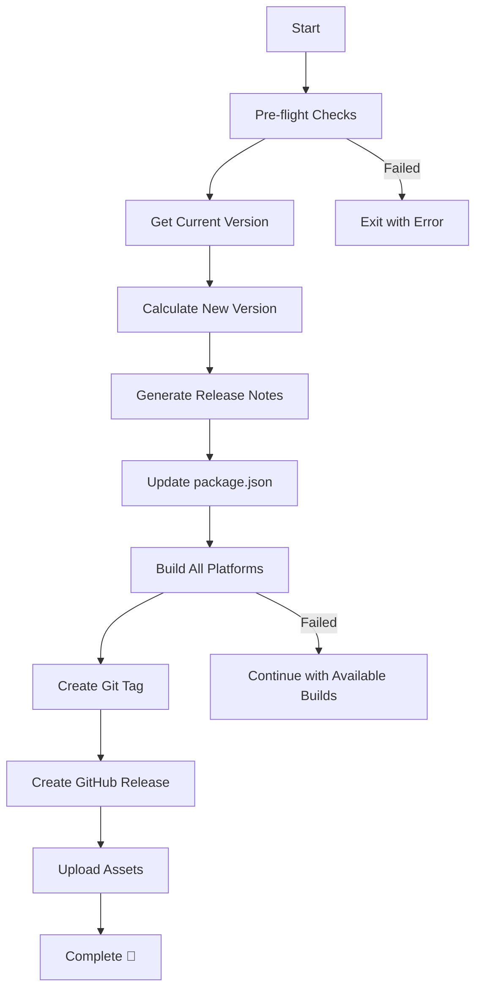

# TTL Release Automation Script

## 🚀 Tự động tăng version và tạo release trên GitHub

Script này tự động thực hiện toàn bộ quy trình release:
- Tăng version theo logic: patch → minor → major
- Build app cho tất cả platforms
- Tạo Git tag và GitHub release
- Upload files build lên GitHub

## 📋 Yêu cầu

### Dependencies
```bash
npm install @octokit/rest --save-dev
```

### GitHub Token
- Đã được cấu hình trong script
- Token có quyền: `repo`, `write:packages`

### Build Environment
- macOS (để build cho tất cả platforms)
- Xcode Command Line Tools
- Electron Builder configured

## 🎯 Version Logic

Format: `major.minor.patch` (x.y.z)

**Increment Rules:**
- `patch < 9`: patch++
- `patch = 9 && minor < 30`: minor++, patch=0  
- `minor = 30`: major++, minor=0, patch=0

**Examples:**
```
1.0.1 → 1.0.2
1.0.9 → 1.1.0
1.30.5 → 1.30.6
1.30.9 → 2.0.0
```

## 📦 Build Platforms

Script sẽ build cho:
- 🍎 **macOS Universal**: TTL-{version}.dmg (Intel + Apple Silicon)
- 🍎 **macOS ARM64**: TTL-{version}-arm64.dmg (Apple Silicon only)
- 🪟 **Windows 64-bit**: TTL-Setup-{version}.exe
- 🪟 **Windows 32-bit**: TTL-Setup-{version}-ia32.exe
- 🐧 **Linux 64-bit**: TTL-{version}.AppImage

## 🔧 Cách sử dụng

### 1. Test Version Logic
```bash
npm run release:test
```

### 2. Test Full Process (Safe)
```bash
npm run release:auto:test
```
- Chạy toàn bộ process nhưng không build/upload thật
- Kiểm tra version increment
- Preview release notes

### 3. Production Release
```bash
npm run release:auto
```
⚠️ **CẢNH BÁO**: Lệnh này sẽ:
- Build thật cho tất cả platforms (~10-15 phút)
- Tạo Git tag và push lên repo
- Tạo GitHub release với files build

### 4. Manual Scripts
```bash
# Chạy script trực tiếp
node scripts/release-automation.js --test  # Test mode
node scripts/release-automation.js        # Production
```

## 📝 Release Notes Auto-Generated

Release notes được tự động tạo từ:
- Git commits từ version trước đến hiện tại
- Template với installation instructions
- Links đến GitHub changelog

**Sample Release Notes:**
```markdown
# Release 1.0.1

## 🚀 What's New
- Fix translation structure issues (a1b2c3d)
- Add localStorage sync for update state (e4f5g6h)

## 📦 Assets
- macOS: TTL-1.0.1.dmg
- Windows: TTL-Setup-1.0.1.exe
- Linux: TTL-1.0.1.AppImage

## 🔧 Installation
[Installation instructions for each platform]
```

## ⚠️ Pre-flight Checks

Script sẽ kiểm tra:
- ✅ Trong Git repository
- ✅ Working directory clean (production mode)
- ✅ package.json tồn tại
- ✅ GitHub token có quyền

## 🔍 Troubleshooting

### Lỗi thường gặp:

**1. ESM Module Error**
```
Error [ERR_REQUIRE_ESM]: require() of ES Module
```
→ **Fixed**: Script đã sử dụng dynamic import

**2. Git Working Directory Not Clean**
```
Working directory is not clean
```
→ Commit hoặc stash changes trước khi chạy

**3. Build Failed for Platform**
```
Failed to build mac --universal
```
→ Kiểm tra Electron Builder config và dependencies

**4. GitHub Upload Failed**
```
Failed to create GitHub release: 401 Unauthorized
```
→ Kiểm tra GitHub token permissions

## 📊 Workflow



## 🎯 Best Practices

1. **Always test first**: `npm run release:auto:test`
2. **Clean working directory**: Commit all changes
3. **Check build locally**: `npm run build` trước khi release
4. **Monitor GitHub Actions**: Kiểm tra build status
5. **Test installations**: Download và test files từ release

## 📚 Scripts Available

| Command | Description |
|---------|-------------|
| `npm run release:test` | Test version logic only |
| `npm run release:auto:test` | Full test process (safe) |
| `npm run release:auto` | Production release |
| `node scripts/release-automation.js --test` | Direct test |
| `node scripts/release-automation.js` | Direct production |

---

## 🚀 Ready to Release?

1. **Test**: `npm run release:auto:test`
2. **Review**: Check version increment và release notes
3. **Release**: `npm run release:auto`
4. **Monitor**: Check GitHub release page
5. **Verify**: Download và test installers

**GitHub Repository**: https://github.com/ttlpro/ttl/releases 